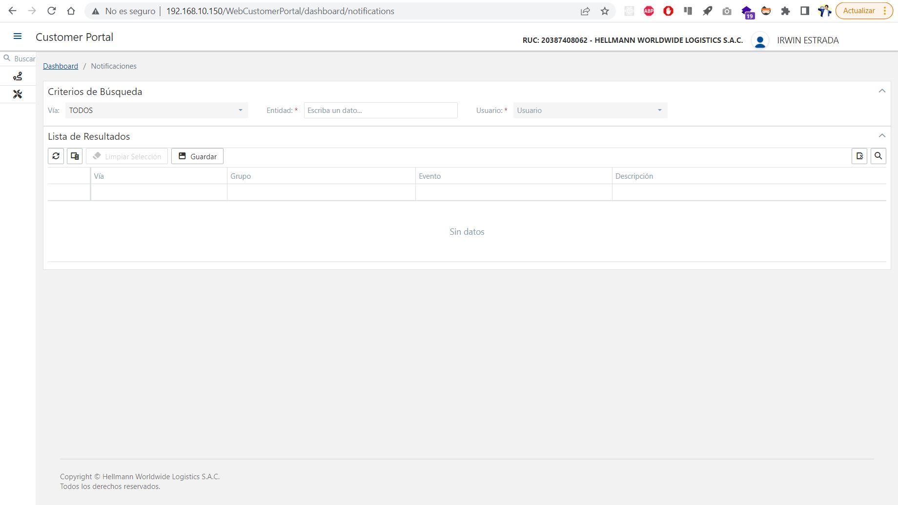
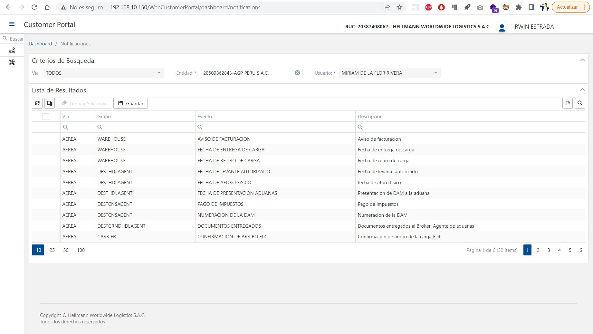
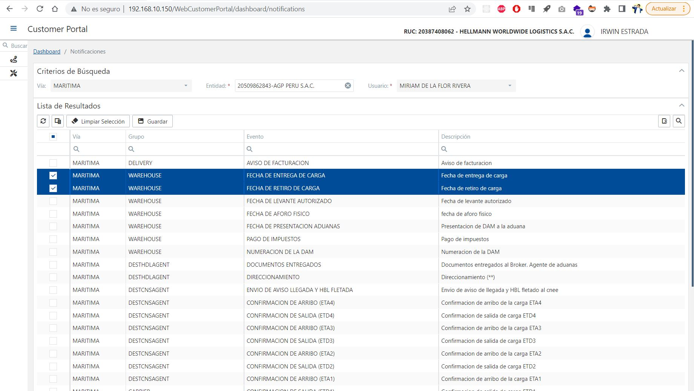
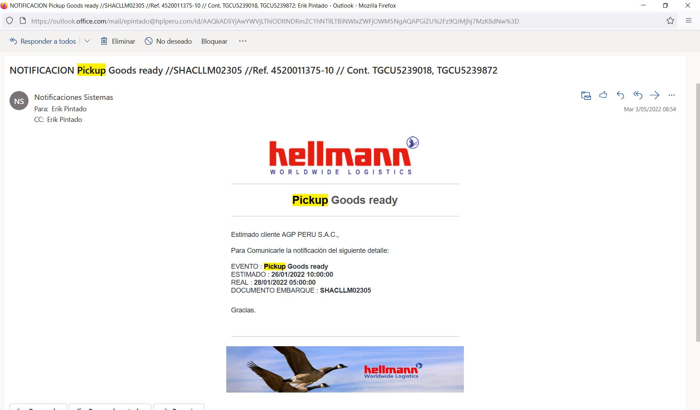

<figure markdown>
  [{ align=center }](./img/notify/notify.jpg)
  <figcaption>Notificaciones</figcaption>
</figure>

## 1. :material-text-search: Búsqueda

Para poder realizar la [Búsqueda](http://192.168.10.150/WebCustomerPortal/dashboard/notifications){:target="_blank"} contamos con los siguientes filtros:

| Nombre      | Valor                                          |
| ----------- | -----------------------------------------------|
| `Vía`       | Aerea o Maritima                               |
| `Entidad`   | Razón Social                                   |
| `Usuario `  | Nombres y Apellidos **(Según la Entidad)**     |

Tomando como ejemplo la búqueda por la **Entidad**, se obtendra el siguiente resultado en la tabla siempre y cuando exista eventos disponibles para la entidad:

<figure markdown>
  [{ align=center }](./img/notify/result-search.jpg)
  <figcaption>Resultado de Búsqueda</figcaption>
</figure>

Los mensajes de respuesta pueden ser:

???+ success

    Si validación fue exitosa: **Nos enviara resultado a la tabla siempre y cuando exista en nuestra base de datos**

???+ failure

    Si ocurre un error al validar indicara: **Servicio Suspendido Temporalmente :(**

## 2. :material-email: Configurar Eventos

Para poder configurar los eventos nos ubicamos en la **Primera Columna** el cual se marca o desmarca al eventos, si algun documento de embarque recibe el evento que tiene configurado le llegara un mensaje a su bandeja de entrada en el correo:

<figure markdown>
  [{ align=center }](./img/notify/notify-config.jpg)
  <figcaption>Configurando Notificación</figcaption>
</figure>

???+ info

    Cuando se tiene eventos ya configurados, estaran seleccionados de color **azul**

{==Tomando como ejemplo algun documento de embarque que reciba una notificación tendra el siguiente formato:==}

<figure markdown>
  [{ align=center }](./img/notify/notify-email.jpg)
  <figcaption>Notificación Correo</figcaption>
</figure>