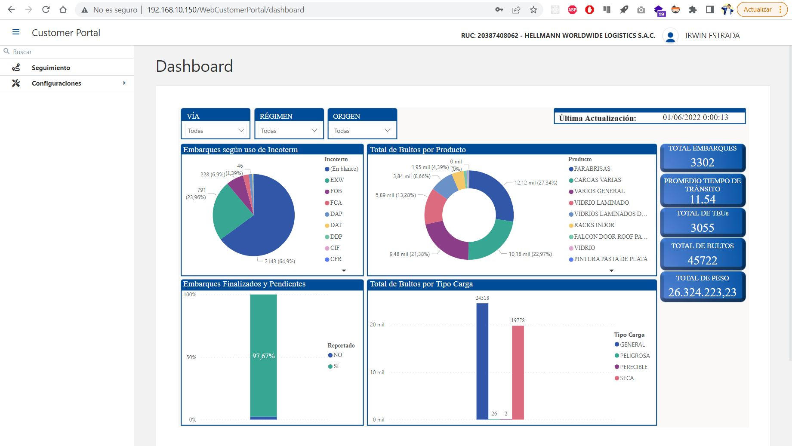

El [Dashboard](http://192.168.10.150/WebCustomerPortal/dashboard){:target="_blank"} se **actualiza diariamente**, contando con datos estadisticos actualizados para el usuario:

<figure markdown>
  [{ align=center }](./img/login/dashboard.jpg)
  <figcaption>Dashboard</figcaption>
</figure>