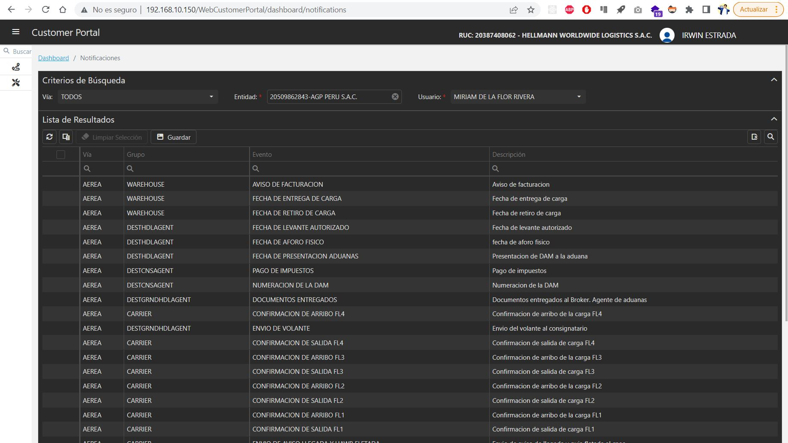

<figure markdown>
  [{ align=center }](./img/login/login.jpg)
  <figcaption>Login</figcaption>
</figure>

## 1. :material-lock: Iniciar Sesión

Para acceder al [Customer Portal](http://192.168.10.150/WebCustomerPortal/login){:target="_blank"} completamos el formulario y hacemos clic en el botón **Iniciar Sesión**:

<figure markdown>
  [{ align=center }](./img/login/form-login.jpg)
  <figcaption>Formulario Login</figcaption>
</figure>

Los mensajes de respuesta pueden ser:

???+ success

    Si validación fue exitosa: **Nos enviara a la pantalla principal**

???+ warning

    Si ocurre una validación indicara: **Usuario o constraseña incorrecta y/o entidad no asignada**

???+ failure

    Si ocurre un error al validar indicara: **Servicio Suspendido Temporalmente :(**

## 2. :material-lock-off: Restablecer Contraseña

Para recuperar las credenciales del [Customer Portal](http://192.168.10.150/WebCustomerPortal/login){:target="_blank"}, hacemos clic en [¿Se te olvidó tu contraseña?](http://192.168.10.150/WebCustomerPortal/reset-password){:target="_blank"}, el cual no pedira completar el siguiente formulario, finalmente hacemos clic en el botón **Restablecer mi Contraseña**:

<figure markdown>
  [{ align=center }](./img/login/reset-password.jpg)
  <figcaption>Formulario Restablecer Contraseña</figcaption>
</figure>

Los mensajes de respuesta pueden ser:

???+ success

    Si validación fue exitosa indicara: **Se envió un enlace de restablecimiento de contraseña a su Correo Electrónico**

???+ warning

    Si ocurre una validación indicara: **El Nombre de Usuario no Existe**

???+ failure

    Si ocurre un error al validar indicara: **Servicio Suspendido Temporalmente :(**

Si la respuesta fue exitoso, procedemos a revisar el correo en nuestra bandeja de entrada y hacemos clic en ^^**Link**^^:

???+ help

    Importante: El ^^**Link**^^ tiene una hora de caducidad, usarlo lo mas pronto posible

<figure markdown>
  [{ align=center }](./img/login/link-reset-password.jpg)
  <figcaption>Correo Restablecer Contraseña</figcaption>
</figure>

Completamos el siguiente formulario para una nueva contraseña y hacemos clic en el botón **Cambiar mi Contraseña**:

<figure markdown>
  [{ align=center }](./img/login/new-password.jpg)
  <figcaption>Formulario Nueva Contraseña</figcaption>
</figure>

Los mensajes de respuesta pueden ser:

???+ success

    Si validación fue exitosa indicara: **Se actualizó la contraseña correctamente**

???+ warning

    Si ocurre una validación indicara: **La contraseña ingresada no es segura**

???+ failure

    Si ocurre un error al validar indicara: 

    - **No se pudo actualizar su contraseña. Comunicar a Sistemas**
    - **Servicio Suspendido Temporalmente :(**

## 3. :fontawesome-solid-user: Perfil

<figure markdown>
  [{ align=center }](./img/login/profile.jpg)
  <figcaption>Perfil</figcaption>
</figure>

En el sub-menu [Perfil](http://192.168.10.150/WebCustomerPortal/dashboard/profile) podemos visualizar mas informacion del usuario autentificado, como el **Correo, Teléfono, etc**.

???+ info

    Contamos con una opción **Tema Dark**, el cual se puede **Activar o Desactivar**.

    Una ejemplo de alguna pantalla del sistema:

    [{ align=center }](./img/login/theme-dark.jpg)        
