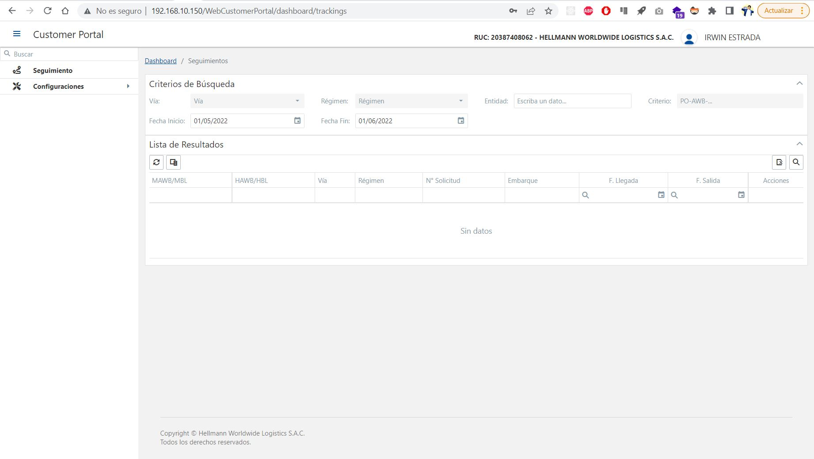
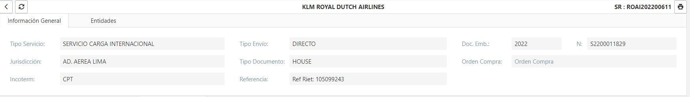

<figure markdown>
  [{ align=center }](./img/login/tracking.jpg)
  <figcaption>Seguimiento</figcaption>
</figure>

## 1. :material-text-search: Búsqueda

Para poder realizar la [Búsqueda](http://192.168.10.150/WebCustomerPortal/dashboard/trackings){:target="_blank"} contamos con los siguientes filtros:

| Nombre      | Valor                                                                                    |
| ----------- | ---------------------------------------------------------------------------------------- |
| `Vía`       | Aerea o Maritima                                                                         |
| `Régimen`   | Importación o Exportación                                                                |
| `Entidad`   | Razón Social                                                                             |
| `Criterio`  | Código de Solicitud, Embarque, Número de Documento de Embarque, PO, Número de Contenedor |
| `F. Inicio` | F. Creación Inicio                                                                       |
| `F. Fin`    | F. Creación Fin                                                                          |

Tomando como ejemplo la búqueda por el **Criterio**, se obtendra el siguiente resultado en la tabla siempre y cuando exista en nuestra base de datos:

<figure markdown>
  [{ align=center }](./img/login/result-search.jpg)
  <figcaption>Resultado de Búsqueda</figcaption>
</figure>

Los mensajes de respuesta pueden ser:

???+ success

    Si validación fue exitosa: **Nos enviara resultado a la tabla siempre y cuando exista en nuestra base de datos**

???+ failure

    Si ocurre un error al validar indicara: **Servicio Suspendido Temporalmente :(**

## 2. :material-map-marker-path: Ver Seguimiento

Para ver el seguimiento, se debio realizar la [Búsqueda](http://192.168.10.150/WebCustomerPortal/dashboard/trackings){:target="_blank"} por algun filtro. El resultado en la tabla tiene una columna **Acciones** donde se puede visualizar el icono de **Ver Seguimiento**, procedemos a hacer Clic y se visualizara la guiente ventana:

<figure markdown>
  [{ align=center }](./img/login/show-tracking.jpg)
  <figcaption>Ventana de Seguimiento</figcaption>
</figure>

La ventana cuenta con la siguiente información:

=== "Tracking Line"

    Esta linea de tiempo cambiara a medida que se completen eventos desde el punto **INICIO** al punto **ENTREGADO**,
    adicional se agrego un ToolTip en cada punto para que el usuario pueda ver el nombre del evento y la fecha real o estimado.

    [{ align=center }](./img/login/tracking-line.jpg)

=== "Tracking Transportista"
    
    Esta tabla muestra información de los eventos generados en el repositorio del transportista, los cuales seran actualizados a medida que el transportista actualice los eventos.

    [{ align=center }](./img/login/tracking-win.jpg)        

=== "Tracking Hellmann"

    === "Linea"

        Esta linea de tiempo muestra los eventos de [Hellmann Worldwide Logistics](http://www.hellmannperu.com/){:target="_blank"} organizados de manera descendente (Destino-Origen).

        [{ align=center }](./img/login/tracking-hwl-line.jpg)                

    === "Tabla"

        Esta tabla muestra los eventos de [Hellmann Worldwide Logistics](http://www.hellmannperu.com/){:target="_blank"} organizados de manera descendente (Destino-Origen) y coloreados de acuerdo al grupo al que pertenece el evento.

        [{ align=center }](./img/login/tracking-hwl-table.jpg)                      

=== "Ver Más"

    Este botón apertura una nueva ventana con mas información del registro seleccionado, esta ubicado en la parte inferior derecha de la ventana.

## 3. :material-file-search: Ver Documentos

## 4. :material-eye-plus: Ver Más

Despues de aperturar la ventana **Ver Seguimiento** procedemos a hacer clic en el botón **Ver Más**, el cual mostrara la siguiente vista:

<figure markdown>
  [{ align=center }](./img/login/tracking-detail.jpg)
  <figcaption>Detalles de Seguimiento</figcaption>
</figure>

La vista cuenta con la siguiente información:

=== "Información General"

    En este formulario podemos ver datos como el **Incoterm, Jurisdicción, Tipo Servicio, etc.**

    [{ align=center }](./img/login/tracking-detail-information.jpg)    

=== "Entidades"

    En este formulario podemos ver datos como el **Importador, Notificante, Agente, Shipper, etc.**

    [{ align=center }](./img/login/tracking-detail-entity.jpg)        

=== "Itinerario"

    En esta tabla de muestra información sobre las conexiones que pueden o no haber entre el tramo **ORIGEN** y **DESTINO**, ademas, se muestra fechas de salida o llegada.

    [{ align=center }](./img/login/tracking-detail-itinerary.jpg)            

=== "Detalle de Carga"

    === "Productos & Bultos"

        En esta tabla se muestra datos de los productos como el tipo de empaque, descripción, etc.

        [{ align=center }](./img/login/tracking-detail-product.jpg)            

    === "Contenedores"

        En esta tabla se muestra datos del contenedor como el número de precinto, etc; si es que tuviera. 

        {==Se tomara otra solicitud que tenga información de contenedores==} 

        [{ align=center }](./img/login/tracking-detail-container.jpg)           

=== "Documentación"

    En esta ventana se muestran los archivos del **módulo de operaciones (HellData)**, siempre y cuando este marcado para el cliente, agente, etc; en caso que sea un usuario interno, podra visualizar todos los documentos disponibles y podra visualizar o descargarlo para fines de trabajo.

    [{ align=center }](./img/login/tracking-detail-helldata.jpg)   

    Para visualizar el archivo, nos ubicamos en la columna **Acciones** de la tabla y hacemos clic en el Icono, despues de eso se apertura una venta abriendo o descargando el archivo:

    [{ align=center }](./img/login/tracking-detail-helldata-download.jpg)       